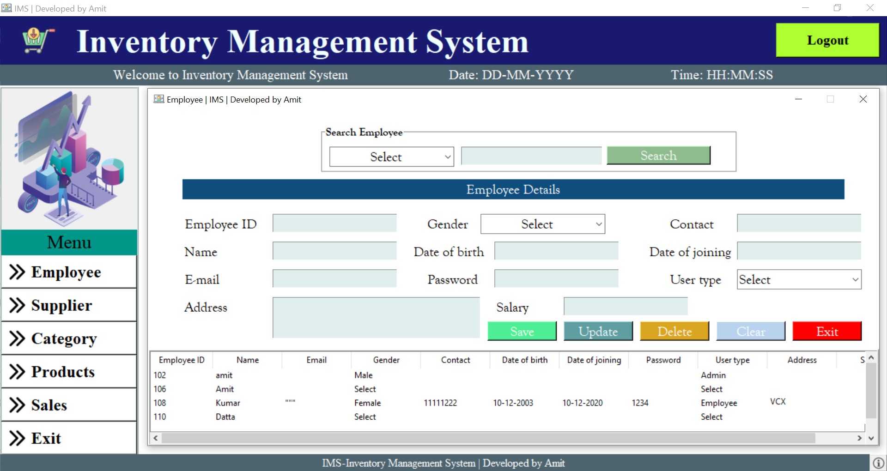
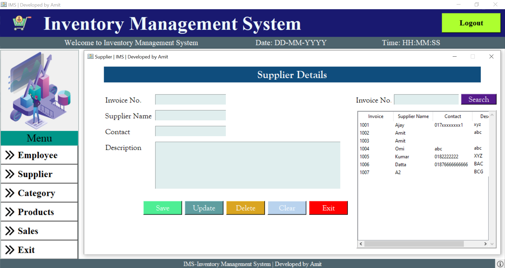
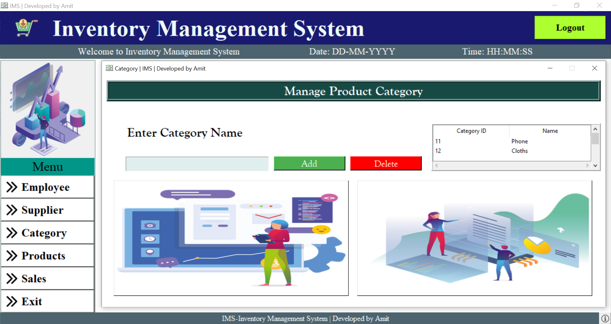
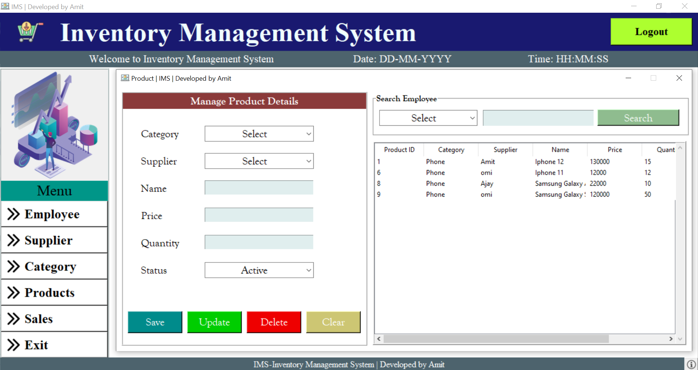
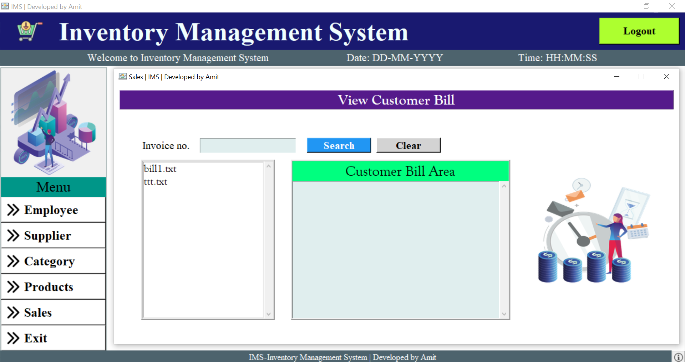
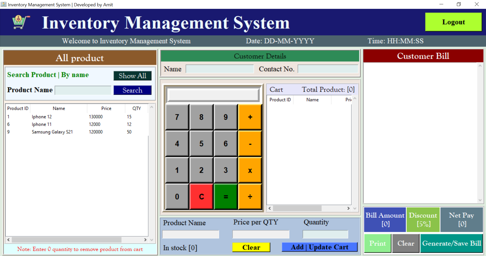

   # Inventory Management System Using Python Tkinter

  

## Introduction

Inventory managemrnt system is an open source platform for manage business. It has a comprehensive, flexible ecosystem of tools, libraries, and community resources that lets businesses push to manage their system most effectively.

This is a software for practice of developing a system from completely scratch. Understanding this will help a lot in system development and basic structure of a system along with GUI with python library Tkinter.

This software was originally developed by Amit Kumar Datta

# Motivation
This project is motivated by Web code's inventory managment system. Here his project- [Inventory Management System with Database | Complete GUI Python Project](https://www.youtube.com/playlist?list=PL4P8sY6zvjk6ef4lpm6XiwJVRahLCp6DI). His youtube channel- [Web code](https://www.youtube.com/channel/UCKJnF_GhwvmXqtGh9LePXpg)

# System Overview

The System consists of two main components -

* Admin tab
* Employee tab

## Methodology
### Dashbord

Dashbord is only available for only Admin. Admin can see full overview of business.

### Employee

In empolyee tab admin can add, delete and update employee.

### Supplier

It also available for only Admin. In empolyee tab admin can add, delete and update employee.

### Category

In Category tab admin can add, delete category.

### Product

In product tab admin can add, delete and update product.

### Sales

In sales tab admin can see bills.

### Billing

This tab is available for employee. In Billing tab employee can create bill with selected price in product tab.

## Contributing
The main reason to publish something open source, is that anyone can just jump in and start contributing to my project.
So If you'd like to contribute, be sure to review the contribution guidelines and then please fork the repository and use a feature branch. Pull requests are warmly welcome.

## Author
Amit Kumar Datta 
Student at class 10 
Municipal model high school, Chittagong 
Bangladesh

## License

[MIT License](LICENSE)
